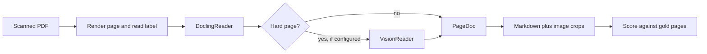

# Scan preservation tool

The study guides stay original notes. This tool is a separate layer that transcribes a scanned PDF into per-page Markdown: prose as text, math and tables as LaTeX, figures as cropped images. The Chu scan is the first validation set, not special-cased in the converter.

The Internet Archive text layer is the wrong source. It hyphenates, splits words (`Fi undamentals`), and misreads section numbers. The default reader forces full-page OCR on the page image. Page numbers come from PDF page labels. On the labeled sibling [`docs/Digital_computer_design_fundamentals__Yaohan_Chu_1962_toc.pdf`](docs/Digital_computer_design_fundamentals__Yaohan_Chu_1962_toc.pdf), printed page 1 is already label `1` and the preface is `vii`. The original scan stays read-only.

## Package

A uv project at [`preserve/`](preserve/), independent of the chapter notebooks.

- `preserve convert INPUT.pdf OUT_DIR [--reader local|vision|auto] [--pages 1,xi,6]`
- `preserve score GOLD_DIR` converts the gold manifest and prints a score report
- Generated book output under `preserve/out/` is gitignored. The full 504-page run waits until the gold score is worth keeping.

Shared intermediate, `PageDoc`: page label, PDF index, and blocks (`prose`, `heading`, `equation`, `table`, `figure`, `caption`, `footnote`, `header`, `footer`) with text or LaTeX and a bbox. Both readers fill this. One writer emits the files, so the readers cannot drift into different Markdown dialects.

Per page, `OUT_DIR/pages/<label>.md` plus `OUT_DIR/images/<label>-figN.png`. Front matter records the source file, the PDF page, the printed label, and which reader wrote the page. Displayed math is `$$...$$`. Inline math is `$...$`. Tables are `tabular` (including math inside cells), not pipe tables. A figure is a crop plus its caption. Running headers and footers are detected when the same line repeats across pages, then dropped. Line-break hyphens are joined. Paragraphs are not merged across pages in these files.

## Readers

**Default, local.** Docling with `do_ocr=True`, `force_full_page_ocr=True` (so the Scribe text layer is not reused), `do_table_structure=True`, `do_formula_enrichment=True`, and `generate_picture_images=True`. The tool reads Docling’s document model and writes LaTeX tables itself; it does not keep Docling’s Markdown table export. OCR engine is RapidOCR or EasyOCR, device `auto`.

**Optional vision reader.** Same `Reader` protocol. Disabled unless a base URL and model are set in the environment. `--reader vision` sends the page image. `--reader auto` runs Docling first and escalates that page only when the local result is hard: mean OCR confidence below a threshold, a picture or table region with an empty body, or a formula region with no LaTeX. The vision adapter asks for the same block JSON, not free-form Markdown.

## Validation on Chu

Gold lives in `preserve/gold/chu/`: a manifest of printed labels and a hand-checked Markdown file per page. Strata, using the labeled PDF:

- Contents, two columns: `xi`
- Chapter opening and displayed equations: `1`
- Ruled algorithm table: `6` (Table 1-3)
- Boolean overlines: `89`
- A chart or diagram page in chapter 4 or 5, chosen by the first picture the layout model marks
- Index: `473`
- Image-only end plate: the unlabeled symbol plate

The scorer normalizes whitespace and dropped headers, then reports character error rate on prose, normalized-LaTeX match on equation blocks, cell accuracy on `tabular`, and whether each gold figure has a crop and caption. The first successful run records the baseline. Later runs fail on a regression against that baseline. No Chu titles or the `+18` offset belong in the converter.

## Repo boundary

Update the source-of-truth table in [`AGENTS.md`](AGENTS.md): `preserve/` owns transcription; `study-guides/` stays a distillation and must not paste scan prose; `docs/*.pdf` stays read-only. The labeled PDF is an input to the tool, not a second book.
